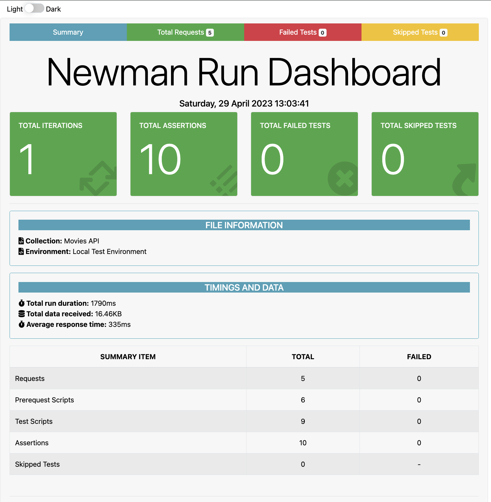
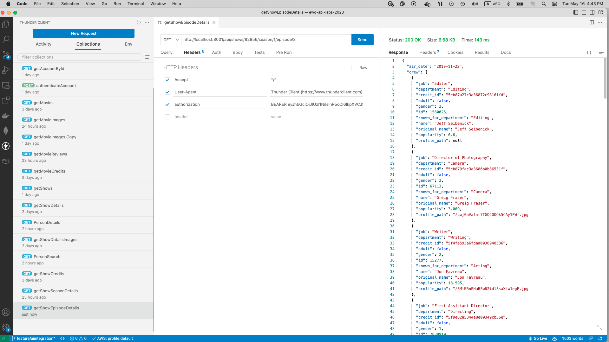
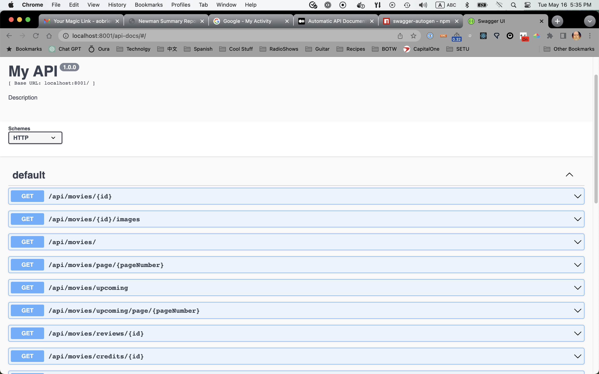

# Assignment 2 - Web API.

Name: Aaron O'Brien
Github URL: https://github.com/setu-aaron/ewd-api-labs-2023  
Youtube Video URL: https://youtu.be/wcrTd-zCACg  

## Features.
Features/Endpoints implemented not in the lab:
 + Feature  1 - /api/movies/page/:pageNumber - paginated view of popular movies based on page number requested  
 + Feature  2 - /api/movies/review/:movieId - reviews of a specific movie using movie id  
 + Feature  3 - /api/movies/credits/:movieId - credits of a specific movie using movie id  
 + Feature  4 - /api/movies/:id/images - images of a specific movie using movie id  
 + Feature  5 - /api/shows - list of popular shows  
 + Feature  6 - /api/shows/page/:pageNumber - list of popular tv shows based on page number requested  
 + Feature  7 - /api/shows/:id - details of a specific tv show  
 + Feature  8 - /api/shows/:id/images - images of a specific tv show using movie id  
 + Feature  9 - /api/shows/credits/:pageNumber - credits of a specific tv show using movie id  
 + Feature 10 - /api/shows/:showId/season/:seasonNumber - details about specific season of a show passing using show id and season number  
 + Feature 11 - /api/shows/:showId/season/:seasonNumber/episode/:episodeNumber - details about a specific episode based on show id, season number and episode number  
 + Feature 12 - /api/person/:id - details of a person.  Could be an actor, director, et.c 
 + Feature 13 - /api/person/search/:query - search capability looking for people passing in free form text to search

## Installation Requirements
There are several ways to setup this api to run.  The [youtube video](https://youtu.be/F9Z3G3_jYdQ) was recorded with the following setup:

Step 1 get mongo running
```
docker pull mongo
docker run -d -p 27017:27017 --name test-mongo mongo:latest
```

Step 2 get the code running
```
git clone git@github.com:setu-aaron/ewd-api-labs-2023.git
cd ewd-api-labs-2023
npm install
npm start
```

If you want to get it running in codespaces it is possible that this link could work:
[Code Spaces](https://setu-aaron-refactored-space-broccoli-565wx4p6vv6c4qpg.github.dev)

If you could access that url all you would need to do would be to execute the command:
```
npm start
```

The third option would be to checkout the code, open vscode and connect to codespaces.
If this is is a clean install of VSCode you will want to install the "GitHub Codespaces" plugin.
You can either open the command pallette (Shift - Command - P) search for Create codespace

Once you have created it and you stopped the container you can click on the bottm left button that looks a little like this: >< and select connect to codespace.
Once the container is up and running you execute.  Mongo sould already be up and running.

```
npm install
npm start
```


## API Configuration
The most common reason for the service to fail is that the ``.env`` file is missing. It contains sensitive information that looks like this:
```
NODE_ENV=development
PORT=<port>
HOST=localhost
DATABASE_DIALECT=mongo
DATABASE_URL=<mongo url>
TMDB_KEY=<YOUR_TBDM_KEY>
JWT_SECRET_KEY=<sometext>
```


## API Design
[Give an overview of your web API design, perhaps similar to the following: ]

|  |  GET | POST | PUT | DELETE
| -- | -- | -- | -- | -- 
| /api/accounts | retrieve all accounts | save account | N/A | N/A
| /api/accounts/:id | retrieve an account based on id | Update the account based on id | N/A | N/A
| /api/accounts/security/token | N/A | validate account based on email | N/A | N/A 
| /api/accounts/:id/favorites | retrieve favorites based on user id | saved favorites based on user id | N/A | N/A
| /api/genres/ | retrieve genres saved in mongo db | N/A | N/A | N/A 
| /api/genres/ | load mongo db based on genres stored in tmbdb | N/A | N/A | N/A 
| /api/movies/ | retrieve the first page of popular movies | N/A | N/A | N/A 
| /api/movies/page/:pageNumber | retrieve the specified page number of popular movies | N/A | N/A | N/A 
| /api/movies/:id | retrieve the details of a specific movie based on id | N/A | N/A | N/A
| /api/movies/:id/images | retrieve image urls of a specific movie using movie id  | N/A | N/A | N/A
| /api/movies/upcoming/ | retrieve the first page of upcoming shows | N/A | N/A | N/A 
| /api/movies/upcoming/page/pageNumber | retrieve the specified page of upcoming shows | N/A | N/A | N/A 
| /api/movies/review/:movieId | reviews of a specific movie using movie id | N/A | N/A | N/A 
| /api/movies/credits/:movieId | credits of a specific movie using movie id | N/A | N/A | N/A 
| /api/person/:id | details of a person.  Could be an actor, director, etc | N/A | N/A | N/A
| /api/person/search/:query | search capability looking for people passing in free form text to search | N/A | N/A | N/A
| /api/shows | list of popular shows  | N/A | N/A | N/A
| /api/shows/page/:pageNumber | list of popular tv shows based on page number requested  | N/A | N/A | N/A
| /api/shows/:id | details of a specific tv show  | N/A | N/A | N/A
| /api/shows/:id/images | images of a specific tv show using movie id  | N/A | N/A | N/A
| /api/shows/:id/credits | credited people specified by show id.  Could be actors, directors, etc.  | N/A | N/A | N/A
| /api/shows/:showId/season/:seasonNumber | details about specific season of a show passing using show id and season number | N/A | N/A | N/A 
| /api/shows/:showId/season/:seasonNumber/episode/:episodeNumber | details about a specific episode based on show id, season number and episode| N/A | N/A | N/A

## Security and Authentication
The API's are locked down by an authentication header. Basically a bearer token is passed into the services and validated using a Tokenizer framework. Inside the code this implemented using a controller that is configured in each routes configuration once the framework was implemented adding it was one line of code:
~~~Javascript
router.route('/*').all(accountsController.verify);
~~~

The UI was that was demo'd in the [youtube video](https://youtu.be/F9Z3G3_jYdQ) used an authentication pattern from Supabase.  Security is managed through a user's email that they enter. Once the e-mail is entered, a call is made to save the user id, and setup the bearer token this is then passed to each subsequent call to the server (from the client) the following code shows how most service calls work:
~~~Javascript
  export const getEpisodeDetails = (args) => {
    const [, showId, seasonId, episodeId] = args.queryKey;
    let url = `http://localhost:8001/api/shows/${showId}/season/${seasonId}/episode/${episodeId}`
    return fetch(url,{
      method: 'GET',
      headers: {
      'Content-Type': 'application/json',
      'Authorization': localStorage.getItem('token')
    }
    })
    .then((response) => {
      if (!response.ok) {
        console.log("Error calling url: ", {url});
        throw new Error(response.json().message);
      }
      return response.json();
    })
    .catch((error) => {
       throw error
    });
  }
~~~


## Validation
Validation for the API services starts with the call to this url: ``/api/security/token`` what is returned is the bearer token.  This is stored in the user's local storage and passed back in to the services with each subsequent call.  Once the user has a valid token all calls follow a similar pattern:

URL: /api/shows/${showId}/season/${seasonId}/episode/${episodeId}'
Is mapped by ``src/index.js`` and ``src/shows/routes/index.js``
The following code shows how the url is mapped to specific functions
~~~Javascript
    const showsController = ShowsController(dependencies);
    const accountsController = AccountsController(dependencies);

    router.route('/*').all(accountsController.verify);
    router.route('/:id/season/:seasonId/episode/:episodeId').get(showsController.getEpisodeDetails);
~~~
In the code above the ``AccountsController`` will be called for every url because of teh ``/*`` the code specifies that the verify method should be invoked:
~~~Javascript
    const verify = async(request, response, next) => {
        try {
            //Input
            const authHeader = request.headers.authorization;
            
            //Treatment 
            const accessToken = authHeader.split(" ")[1];
            const user = await accountService.verifyToken(accessToken, dependencies);

            //output
            next();
        } catch (err){
            next (new Error(`Verification failed ${err.message}`));
        }
    };
~~~

There is a call to accountService.verify that leverages the  was implemented with this code:
~~~Javascript
    verifyToken: async (token, {accountsRepository, tokenManager}) => {
        const decoded = await tokenManager.decode(token);
        const user = await accountsRepository.getByEmail(decoded.email);
        if (!user){
            throw new Error('Bad token');
        }
        return user.email;
    }
~~~
The ``tokenManager`` leverages the ``jsonwebtoken`` library to create and verify the token.

## Testing

Testing was primiarily done via (ThunderClient)[https://www.thunderclient.com/] - this is a plugin in VSCode that works very well.  One feature that I like is that it keeps your tests in your code base and can be run very simply.  This worked very well for me until the lab where we used Postman and exported the tests and put leveraged Newman to run the tests.  I think there is value in using ThunderClient but if you have a separate person or team tesing I would say the Postman/Newman option is probably better.  The below image is screen shot of my newman test report. 

Give an example of any automated testing results or link to a reports. 


Here is a screen shot of the Thunder Client running in VS Code:
Give an example of any automated testing results or link to a reports. 


## Integrating with React App
Integrating with the react app was done by attempting to make the lightest touch possible to the code. 
However, I did run into several problems while trying to get the UI running locally configured to access the services that were running codespaces on github.  I finally found this [URL](https://github.com/orgs/community/discussions/15351) that seems to have similar problems, the fix here didn't seem to help, so I ended up switching everything back to running locally so that me UI could run on the local dev server on port 5173 and the services could run on port 8001.  Mong was running on Docker with the standard mongo port exposed.  This is what ultimately solved my problem.  I did setup an NGINX server to revers proxy these servers to bypass the cors issues but ultimately that felt like more overhead than necessary.

Below is a good example of how the react app talks to the the api services.

~~~Javascript
  export const getEpisodeDetails = (args) => {
    const [, showId, seasonId, episodeId] = args.queryKey;
    let url = `http://localhost:8001/api/shows/${showId}/season/${seasonId}/episode/${episodeId}`
    return fetch(url,{
      method: 'GET',
      headers: {
      'Content-Type': 'application/json',
      'Authorization': localStorage.getItem('token')
    }
    })
    .then((response) => {
      if (!response.ok) {
        console.log("Error calling url: ", {url});
        throw new Error(response.json().message);
      }
      return response.json();
    })
    .catch((error) => {
       throw error
    });
  }
~~~

## Extra features

I implemented the open api or swagger specificaiton with this project.  It was amazingly simple.  I used the following libraries/commands:
```
npm install swagger-ui-express
npm run swagger-autogen
```
I added a (swagger.js)[./swagger.js] script and then modified my ``package.json`` file to be able to allow me to generate the swagger file from the command line using this command:

```
npm run swagger-autogen
```
Modificaitons to package.json:
```
  "scripts": {
    "swagger-autogen": "node ./swagger.js", 
    "start": "nodemon --exec babel-node index.js",
    "test": "newman run ./tests/movies_collection.json -e ./tests/movies_environment.json --reporters htmlextra,cli --reporter-htmlextra-export ./tests/reports/report.html"
  },
```
Here is a screen shot of OpenAPI running:


And a screen shot of one of the services:


## Independent learning.

Coming from a work history of software development primarily working with Java based servers this was completely unfamiliar to me.  There were times where the configuration of the project seemed overly complex but as I implemented new endpoints I found the structure to be quite easy to follow and the clean architecture as discussed in class to be very good.  Clean Architecture is something that has recently come up in conversation at my work so having this source of knowledge coupled with what I've learnd on my own has really helped solidify those concepts.

Also working with express was new for me - in the world of Java where whole indusries of best ways to manage servers have been created over the years to see all of that work basically being replace by:
~~~Javascript
app.listen(port, () => {
  console.info(`Server running at ${port}`);
}); 
~~~
Is amazing, and makes me question if java development started out by embracing complexity - and these new langugages are able to take advantage of those lessons and make server startup and configuration simple first and then add complexity when it's needed.


